# TelegramPandaBot
A practice of [Udemy course](https://www.udemy.com/course/build-telegram-bots-with-javascript-the-complete-guide)    
All rights reserved to [Mark Tan](https://www.udemy.com/user/mark-tan-rj/)  
If you interest in this course, please enroll.  

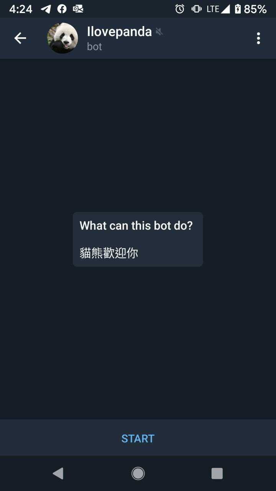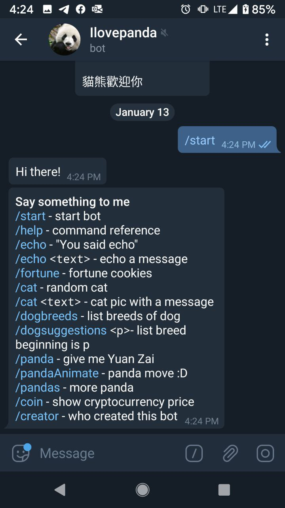
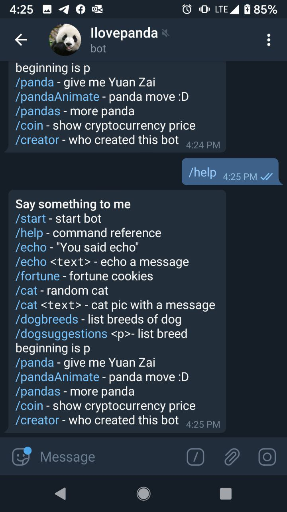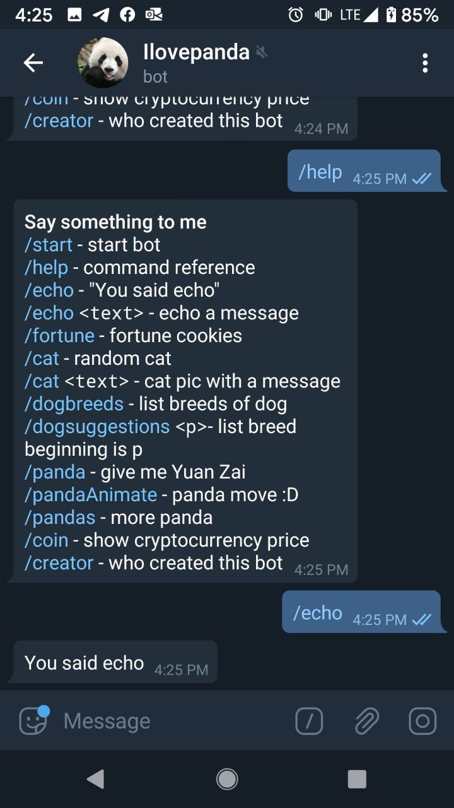
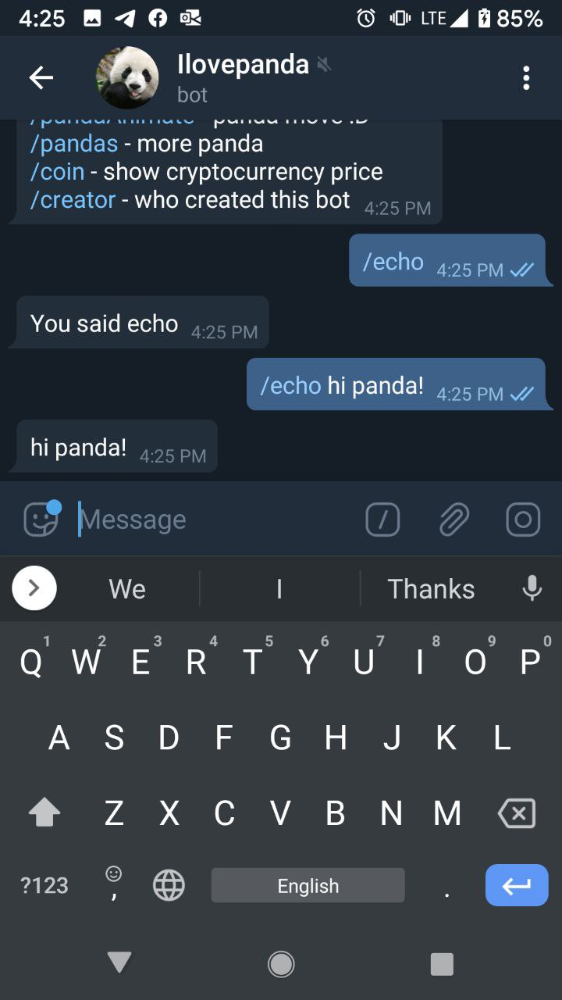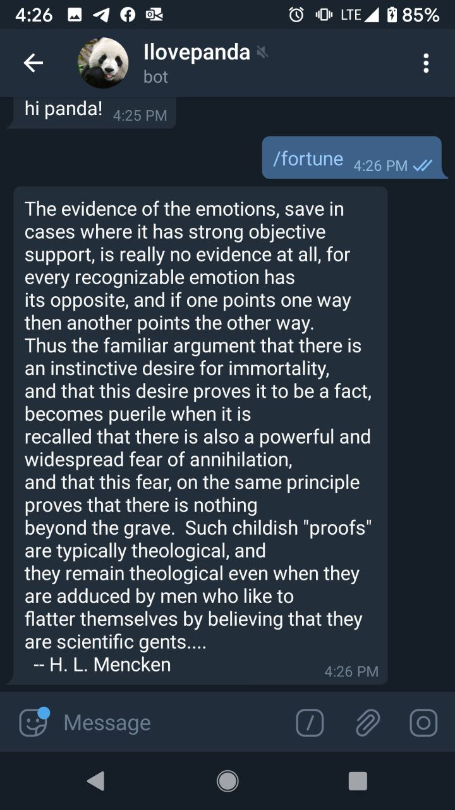
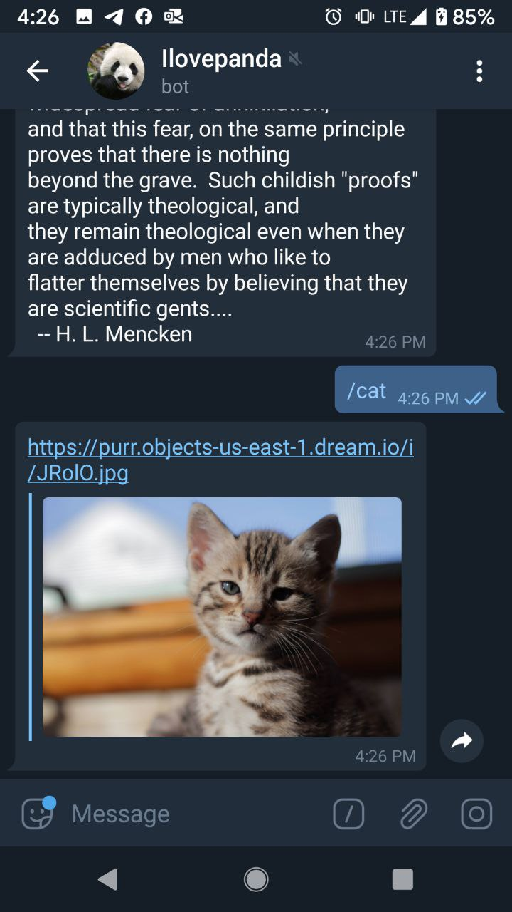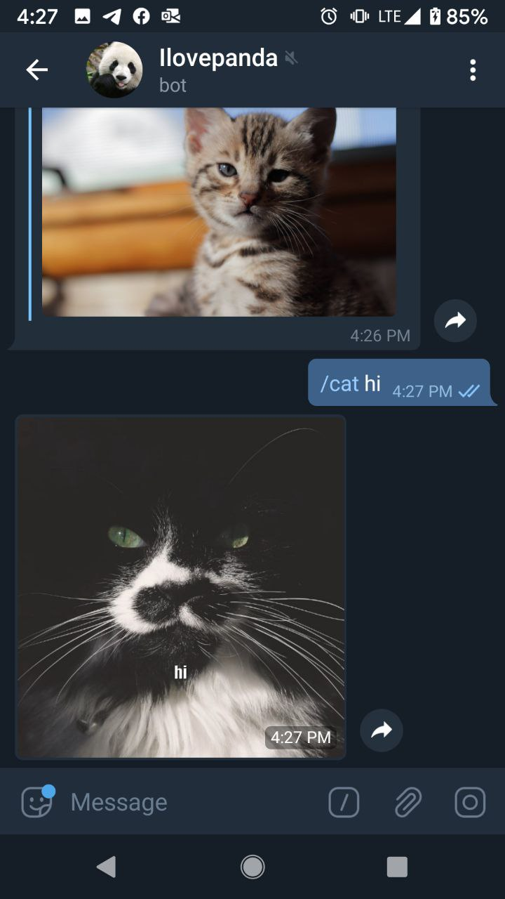
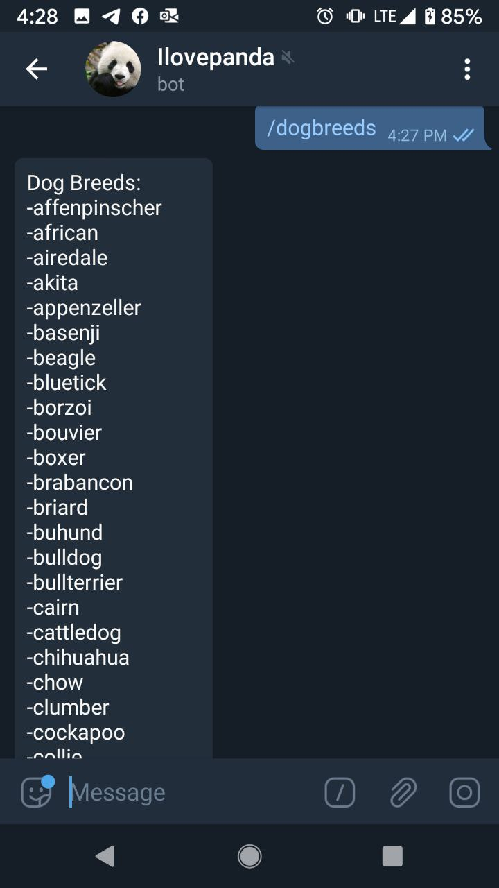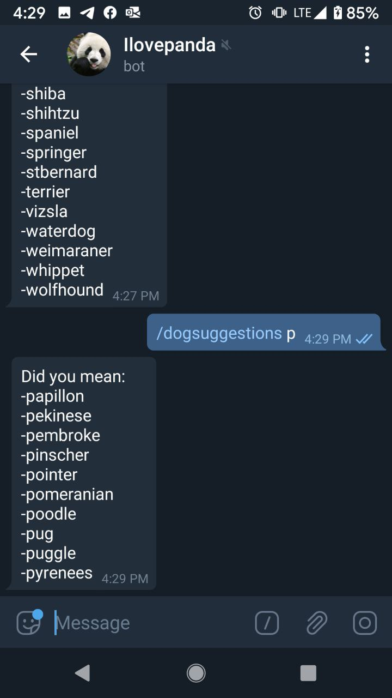
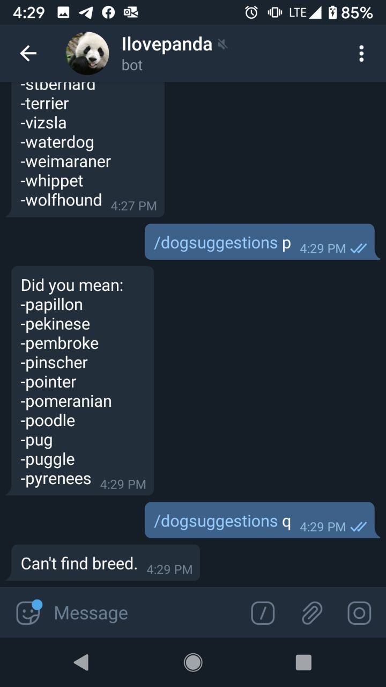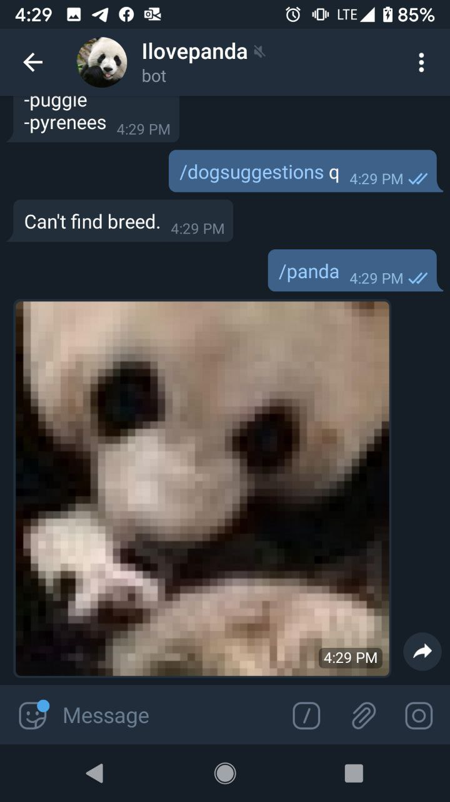
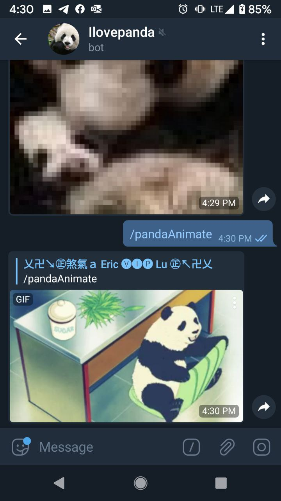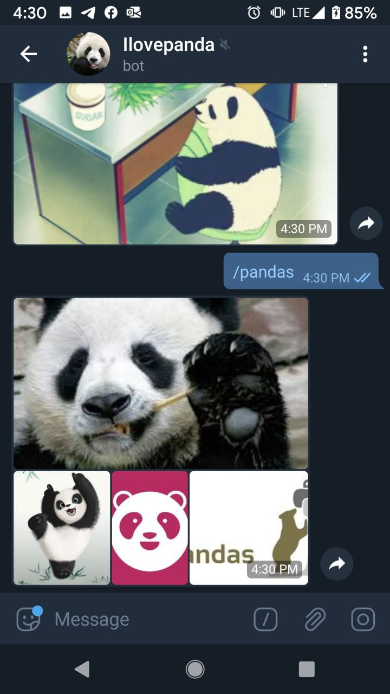

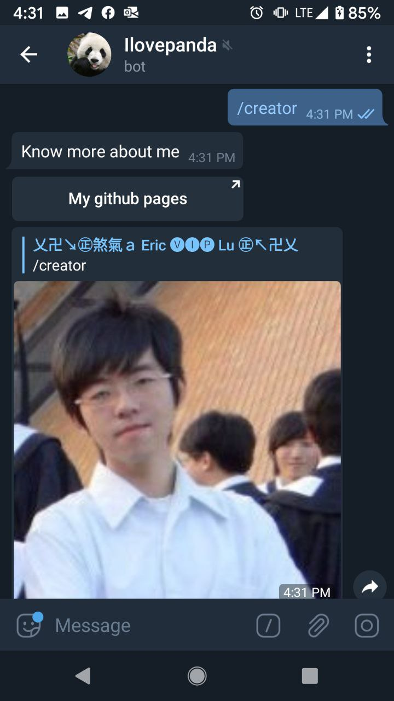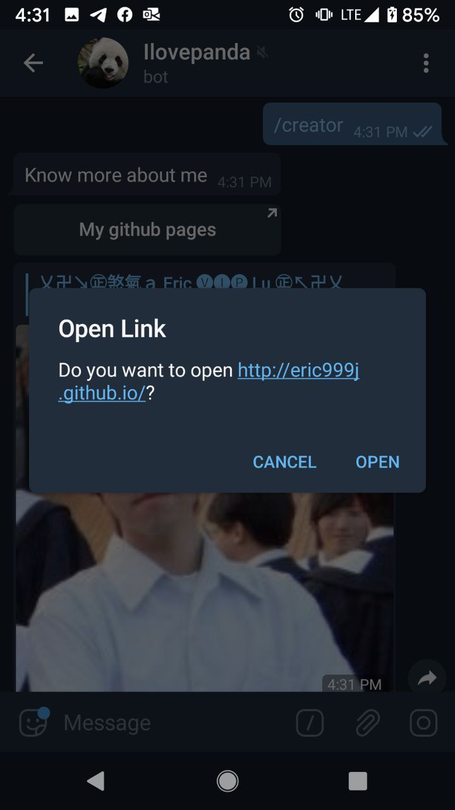
